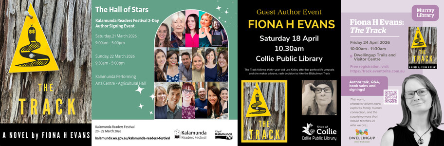

<!--
   
-->

{height=200px} 

<i>What would you do if your perfect life collapsed?</i>

Lee’s perfect life unravels fast. The man she planned to be with forever dumps her and a 
humiliating clash with her new boss forces her to quit her dream job. Desperate to find 
a new life purpose, she makes a brave, rash decision to hike the Bibbulmun Track—a 
thousand-kilometre walking trail through the south-west of Western Australia. Her 
brand-new boots carry her along a wind-swept coastline and through ancient forests, 
but ultimately Lee is on a journey to self-discovery.

This warm, character‑driven novel explores family, human connection, and the surprising 
ways that nature teaches us who we are. It pays tribute to the changing beauty of the 
Western Australian landscape, its flora and fauna, the diverse characters who live in 
and visit the area, and the language, culture and history of the Noongar people 
who are the traditional custodians of this country.

<b>Buy now on Amazon:</b> 
https://www.amazon.com.au/dp/B0GC2GGSF3.

<b>Or ask your local bookstore to order the paperback:</b>
<table style="text-indent: 1cm; padding: 0px;">
<tr>
<td style=" padding: 0px;"> Title: </td> <td style=" padding: 0px;"> The Track </td>
</tr>
<tr>
<td style=" padding: 0px;">  Author: </td> <td style=" padding: 0px;"> Fiona H Evans </td>
</tr>
<tr>
<td style=" padding: 0px;">  ISBN: </td> <td style=" padding: 0px;"><b> 978-1-7644622-0-4 </b></td>
</tr>
<tr>
<td style=" padding: 0px;">  Format: </td> <td style=" padding: 0px;"> Paperback, 266 pages </td>
</tr>
<tr>
<td style=" padding: 0px;">  Trim size: </td> <td style=" padding: 0px;"> 198 mm x 129 mm </td>
</tr>
<tr>
<td style=" padding: 0px;">  Publication Date: </td> <td style=" padding: 0px;">23 March 2026 </td>
</tr>
<tr>
<td style=" padding: 0px;">  RRP: </td> <td style=" padding: 0px;"> AUD $27.99 incl. GST </td>
</tr>
<tr>
<td style=" padding: 0px;">  Distribution: </td> <td style=" padding: 0px;"> IngramSpark </td>
</tr>
</table>

Subscribe to my newsletter on Substack to be informed when the audiobook is launched: https://substack.com/@fionahevans

 

<h2>Readers Say:</h2>  

"I love how you bring the world to life with your writing in the book. 
It's very rich description and a very enjoyable read."  

"Really enjoying reading The Track today. Feel like it could be me."  

"It’s captivating! I only put it down to eat and sleep!"  

"I have been trying to get back to reading and this has made 
me remember why I love it so much."  

"It was a super read. So much to relate to."  

"I’m loving being transported along the Bibbulmun Track and even reading it on my phone isn’t slowing me down. I can’t put it down!"

 

<h2>Upcoming Events</h2> 

<b>Hall of Stars Book Signing at the Kalamunda Readers Festival</b> 
Sunday 22 March 2026 
Kalamunda Performing Arts Centre - Agricultural Hall 
Bookings: https://www.trybooking.com/events/landing/1499178

<b>Guest Author Event</b> 
10:30am Saturday 18 April  
Collie Public Library 
Bookings: https://events.humanitix.com/guest-author-fiona-h-evans

<b>Author Talk, Q&A, Book Sales & Signing</b> 
10:00am Friday 24 April  
Dwellingup Trails and Visitor Centre 
Bookings: https://www.eventbrite.com.au/e/fiona-h-evans-the-track-tickets-1984442533036

<b>Author Talk</b> 
2pm Friday 1 May  
Albany Public Library 
Bookings: https://albany-events.bookable.net.au/#!/event-detail/Thetrack

<b>Author Talk</b> 
2pm Monday 4 May  
Denmark Public Library 

<b>Author Talk</b> 
11am Friday 8 May  
Walpole Public Library 

