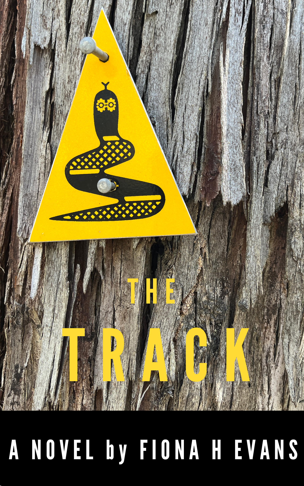

<!--
   
-->

{width=200px}  

<i>What would you do if your perfect life collapsed?</i>

Lee’s perfect life unravels fast. The man she planned to be with forever dumps her and a 
humiliating clash with her new boss forces her to quit her dream job. Desperate to find 
a new life purpose, she makes a brave, rash decision to hike the Bibbulmun Track—a 
thousand-kilometre walking trail through the south-west of Western Australia. Her 
brand-new boots carry her along a wind-swept coastline and through ancient forests, 
but ultimately Lee is on a journey to self-discovery.

This warm, character‑driven novel explores family, human connection, and the surprising 
ways that nature teaches us who we are. It pays tribute to the changing beauty of the 
Western Australian landscape, its flora and fauna, the diverse characters who live in 
and visit the area, and the language, culture and history of the Noongar people 
who are the traditional custodians of this country.

Read the ebook now on Amazon: https://www.amazon.com.au/Track-Fiona-H-Evans-ebook/dp/B0GC2GGSF3

Or subscribe to my newsletter on Substack to be informed when the paperback 
and audiobook are launched: https://substack.com/@fionahevans

<h2>Reader Feedback</h2> 

"I love how you bring the world to life with your writing in the book. 
It's very rich description and a very enjoyable read."  

"Really enjoying reading The Track today. Feel like it could be me."  

"It’s captivating! I only put it down to eat and sleep!"  

"I have been trying to get back to reading and this has made 
me remember why I love it so much."  

"It was a super read. So much to relate to."  

"I’m loving being transported along the Bibbulmun Track and even reading it on my phone isn’t slowing me down. I can’t put it down!"

